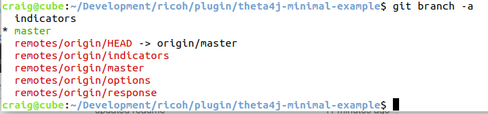

# theta4j plug-in minimal Java example

This is a minimal plug-in example of using Shiro's 
[theta4j library](https://github.com/theta4j/theta-web-api) 
for the RICOH THETA.

It is intended for people that like to learn from the smallest possible
piece of Java code. In the spirit of a really small
"Hello, World" type of application, this example does not use the 
[RICOH THETA Plug-in SDK](https://github.com/ricohapi/theta-plugin-sdk).

If you start from a new empty activity, you need to adjust the 
gradle build files and the AndroidManifest.xml for permissions.

If you prefer Kotlin, Shiro has an [example](https://github.com/theta4j/theta-web-api/tree/master/plugin-example).

To keep the Master git branch simple, the demo is divided into 
multiple branches. After you clone the repository, use `git branch -a`
to see all the branches. Then checkout a branch with `git checkout options`.

## HTTP Response from Camera
The [response branch](https://github.com/codetricity/theta4j-minimal-example/tree/response) shows how to get the camera HTTP response from the WebAPI command. It shows how to receive the URI for the last picture taken.

## Get and Set Camera Options
The [options branch](https://github.com/codetricity/theta4j-minimal-example/tree/options) shows to to get and set camera settings. ISO, exposure compensation, capture mode.

## Audio and Visual Indicators of Camera Status
The [indicators branch](https://github.com/codetricity/theta4j-minimal-example/tree/indicators)
shows use of a camera beep and magenta LED to show the start of a 
multi-picture loop.

